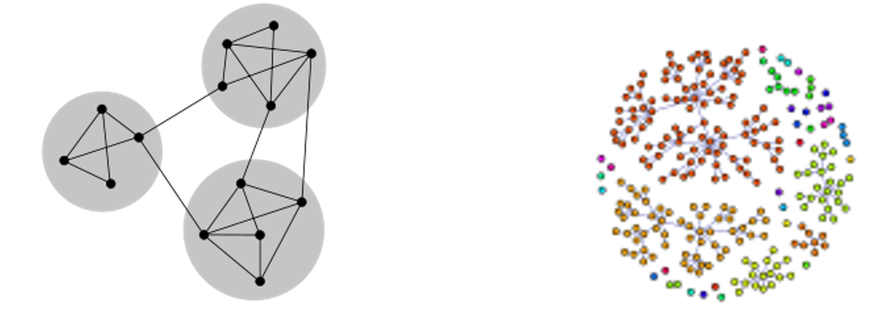

# Lab02 - Metoda Greedy 

## :microscope: Obiective 

Formularea problemelor ca probleme de căutare şi identificarea modalităţilor de rezolvare a lor bazate pe algoritmi de tip greedy. Specificarea, proiectarea şi implementarea metodelor de căutare bazate pe algoritmi de tip greedy.

## :book:  Aspecte teoretice 

- Rezolvarea problemelor ca proces de optimizare
- Tipuri de probleme de optimizare.
- Modalităţi de rezolvare a problemelor de căutare -> Identificarea soluţiei potenţiale optime:
    - Stabilirea componentelor problemei 
        - Condiţii (constrângeri) pe care trebuie să le satisfacă (parţial sau total) soluţia  
        - Funcţie de evaluare a unei soluţii potenţiale -> identificareaa optimului
    - Definirea spaţiul de căutare 
    - Stabilirea strategiei de identificare a soluţiei optime în spaţiul de căutare 

## :bulb: Probleme

**Problema identificării comunităților într-o rețea complexă**

Descoperirea și analiza comunităților în rețele este o temă larg dezbătută în sociologie, biologie și informatică. Rețelele complexe reprezintă suportul pentru diferite sisteme reale (facebook, sistemul imun, creierul, infrastrcutura de transport, etc.). O comunitate în aceste rețele este definită ca un grup de noduri dens conectate unele cu altele, dar puțin conectate cu noduri din alte comunități. 

La ce ajută identificarea acestor comunități? Click pentru câteva exemple

1.	cum influenteaza tipul relatiilor dintre studenti definirea comunitatilor ce pot aparea in reteaua pe care o formeaza? (Exista mai mult tipuri de relatii in datasetul furnizat, comunitatile create au o diveristate in tipurile de relatii? Sau “cine se aseamana se aduna”?)
    - [dataset](http://networkrepository.com/soc-student-coop.php)
    - [lucrare]http://www.ise.bgu.ac.il/faculty/fire/pdf/fire2012predicting.pdf)

2.	cum tind sa formeze comunitati persoanele populare aka influencers pe tweeter (aici se poate discuta definitia popularitatii prin diferite metrici ca si degree centrality, betweeness centrality, articulation point) - principiul "cine se aseamana se aduna")
    - [dataset](http://networkrepository.com/soc-twitter-follows.php)
    - [lucrare](https://arxiv.org/pdf/1211.4266.pdf)

3.	comportamentul social al furnicilor (retea dinamica) - sunt furnicile insecte sociale? isi schimba des comunitatile din care fac parte, sau tind sa ramana in aceleasi comunitati? Exista vreun pattern in comportamentul furnicilor in acest sens?
    - [dataset](https://github.com/bansallab/asnr/tree/master/Networks/Insecta/)ants_proximity_weighted)
    - [lucrare](https://www.nature.com/articles/s41597-019-0056-z)

## :memo:  Cerinte 

Se cere identificarea comunităților existente într-o rețea folosind un algoritm Greedy. Se vor folosi:
- informații privind metoda Greedy propusa de Newman - Newman, M. E. (2004). Fast algorithm for detecting community structure in networks. Physical review E, 69(6), 066133. [link](https://arxiv.org/pdf/cond-mat/0309508.pdf)
- reteaua sociala dezvoltata semestrul trecut la MAP (cu construirea in prealabil a grafului corespunzator ei)
- cele 4 rețele / seturi de date din folderul asociat laboratorului current (in format GML – more details [here](https://www.fim.uni-passau.de/fileadmin/dokumente/fakultaeten/fim/lehrstuhl/rutter/abschlussarbeiten/ba-goetz.pdf))
-	rețele / seturi de date identificate de student 

Aplicaţia (specificata, proiectata si implementata) trebuie să permită:
-	Încărcarea datelor problemei 
-	Alegerea şi parametrizarea metodei de rezolvare a problemei
-	Afişarea soluţiei identificate
-	Precizarea performanţelor metodei de rezolvare alese

Aplicația trebuie să respecte specificațiile privind datele de intrare și datele de ieșire.

Aplicația va fi testată folosind date de difcultăți diferite (fiecare test validat având asociat un anumit punctaj).

Datele de intrare sunt reprezentate de:
-	graful retelei
-	parametrii algoritmului

Datele de iesire sunt reprezentate de:
-	numarul de comunitati identificate in graf
-	apartenenta la o anumita comunitate pentru fiecare nod al grafului/retelei

## :hourglass: Termen de predare 
Laborator 3 

## :moneybag: Evaluarea

Punctajele acordate (in funcție de seturile de date folosite) sunt:
-	Seturi de date indicate in documentatie - maxim 200 puncte (50 puncte / retea – sunt 4 retele in arhiva real-networks.zip) 
-	Seturi de date identificate de student – maxim 300 puncte (50 puncte / retea)|

Notă: 
- punctajul maxim acumulat pentru acest laborator este 500 puncte.
- punctajul minim pentru ca o tema predata sa fie valida este 100 puncte.  

