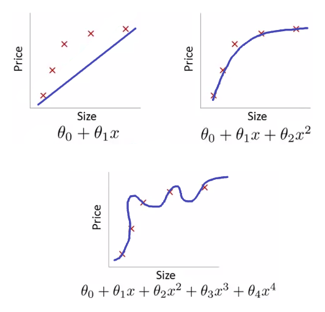

# Lab06 - Rezolvarea unor probleme de regresie prin metode de învățare automată  

## :microscope: Obiective 

Dezvoltarea sistemelor care învaţă singure. Probleme de tip regresie rezolvate cu metoda celor mai mici pătrate. Evaluareaa performanței acestor metode.

## :book:  Aspecte teoretice

Metoda celor mai mici pătrate pentru rezolvarea problemelor de regresie.

Proiectarea sistemelor care învaţă singure.

Evaluarea sistemelor care învaţă singure. Metrici de performanță. 

## :bulb: Probleme

**Ce îi poate face pe oameni fericiți?** 
Se consideră problema predicției gradului de fericire a populației globului folosind informații despre diferite caracteristici a bunăstării respectivei populații precum Produsul intern brut al țării în care locuiesc (gross domestic product – GBP), gradul de fericire, etc. 

Folsind datele aferente anului 2017 (fisierul v1_world-happiness-report-2017.csv), să se realizeze o predicție a gradului de fericire în funcție:
-	doar de Produsul intern brut (exemplu detaliat live - demo)
-   doar de caracteristica "Family" (tema)
-	de Produsul intern brut si de gradul de libertate (temă). 

Rezolvati problema si pentru cazurile in care datele sunt preluate din fisierul:
- v2_world-happiness-report-2017.csv
- v3_world-happiness-report-2017.csv

## :memo:  Cerinte 

Specificaţi, proiectaţi, implementaţi si testati un algoritm de predicție bazat pe metoda celor mai mici pătrate. 
 

🏵️ Cerinte opționale

Studiul comportamentului algoritmului de predictie pentru date corelate sau incomplete.

## :hourglass: Termen de predare 
Laborator 6

## :moneybag: Evaluarea

Punctajele acordate ...
 
1. Rezolvarea problemei (pt datele v1) cu tool – 50 puncte
2. Rezolvarea problemei (pt datele v1) cu cod propriu (fara biblioteci specializate – e.g. sklearn, numpy, skit, opencv, etc) – 200 puncte
3. Rezolvarea problemei (pt datele v2) - 50 puncte
4. Rezolvarea problemei (pt datele v3) - 100 puncte

 Notă: 
- punctajul maxim acumulat pentru acest laborator este 400 puncte.
- punctajul minim pentru ca o tema predata sa fie valida este 100 puncte.  

