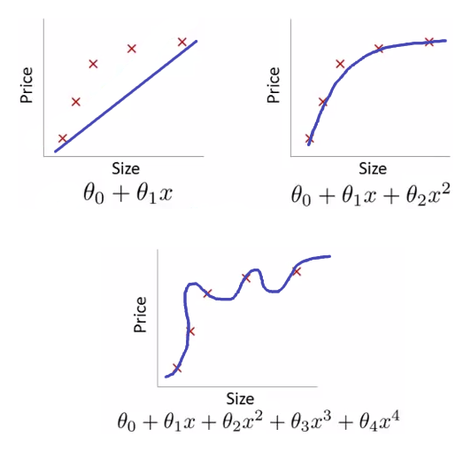

# Lab06 - Rezolvarea unor probleme de regresie prin metode de învățare automată  

## :microscope: Obiective 

Dezvoltarea sistemelor care învaţă singure. 
- Probleme de tip regresie rezolvate cu metoda gradientului descrescator. Evaluareaa performanței acestor metode.
- Probleme de tip clasificare rezolvate cu metoda regresiei logistice. Evaluareaa performanței acestor metode.

## :book:  Aspecte teoretice

Metoda gradientului descrescător pentru rezolvarea problemelor de regresie si de clasificare. 

:exclamation: Normalizarea datele de antrenament si validare/testare.
 

Proiectarea sistemelor care învaţă singure.

Evaluarea sistemelor care învaţă singure. Metrici de performanță. 

## :bulb: Probleme

**Ce îi poate face pe oameni fericiți?** 
Se consideră problema predicției gradului de fericire a populației globului folosind informații despre diferite caracteristici a bunăstării respectivei populații precum Produsul intern brut al țării în care locuiesc (gross domestic product – GBP), gradul de fericire, etc. 

Folsind datele aferente anului 2017 [link](https://www.kaggle.com/unsdsn/world-happiness#2017.csv), să se realizeze o predicție a gradului de fericire în funcție:
-	doar de Produsul intern brut
-	de Produsul intern brut si de gradul de libertate. 

**Clasificarea țesuturilor cancerigene** 
Se consideră informații despre cancerul de sân la femei, informații extrase din ecografii mamare (detalii [aici](https://archive.ics.uci.edu/ml/datasets/Breast+Cancer+Wisconsin+(Diagnostic))) precum:
    -	Tipul malformației identificate (țesut benign sau țesut malign)
    -	Caracteristici numerice ale nucleului celulelor din aceste țesuturi:
        - raza (media distanțelor între centru si punctele de pe contur)
        - textura (măsurată prin deviația standard a nivelelor de gri din imaginea asociată țesutului analizat)
Folosindu-se aceste date, să se decidă dacă țesutul dintr-o nouă ecografie (pentru care se cunosc cele 2 caracteristici numerice – raza și textura –) va fi etichetat ca fiind malign sau benign. 

**Ce fel de floare preferi?** 
Se consideră problema clasificării florilor de iris în diferite specii precum: setosa, versicolor și virginica. Pentru fiecare floare se cunosc caracteristici precum: lungimea și lățimea sepalei, lungimea și lățimea petalei. Mai multe detalii despre acest set se pot găsi [aici](https://archive.ics.uci.edu/ml/datasets/Iris). Folosindu-se aceste informații, să se decidă din ce specie aparține o anumită floare. 

## :memo:  Cerinte 

Specificaţi, proiectaţi, implementaţi si testati cate un algoritm de regresie pentru prima problema bazat pe:
- metoda gradientului descrescator stocastic (demo) - please check the [notebook](SGD/AI-linRegressionSGD.ipynb)
- metoda gradientului descrescator bazat pe batch-uri, cu tool/API si/sau cod propriu (tema).

Specificaţi, proiectaţi, implementaţi si testati cate un algoritm de clasificare pentru problema 2 si problema 3 bazat pe regresie logistica. Antrenati cate un clasificator pentru fiecare problema, pe care apoi sa ii utilizati pentru a stabili:
- daca o leziune (dintr-o mamografie) caracterizata printr-o textura de valoare 10 si o raza de valoare 18 este leziune maligna sau benigna
- specia unei flori de iris care are sepala lunga de 5.35 cm si lata de 3.85 cm, iar petala lunga de 1.25 cm si lata de 0.4cm

🏵️ Cerinte opționale

Rezolvarea unei probleme de regresie/clasificare prin:
- folosirea validarii încrucișate
- investigarea diferitelor funcții de loss
- ce se întîmplă în cazul clasificarii binare daca se modifică pragul de decizie din 0.5 în alte valori. Cum se poate aprecia calitatea clasificatorului pentru diferite valori ale pragului?

## :hourglass: Termen de predare 

Laborator 7

## :moneybag: Evaluarea

Punctajele acordate:

- problema 1 - batch-uri
    - tool 50p
    - cod propriu 100p
- problema 2
    - tool 50p
    - cod propriu 100p
- problema 3
    - tool 50p
    - cod propriu 100p
- cerinte optionale 150p

Notă: 

- punctajul maxim acumulat pentru acest laborator este 600 puncte.

- punctajul minim pentru ca o tema predata sa fie valida este 200 puncte.  

