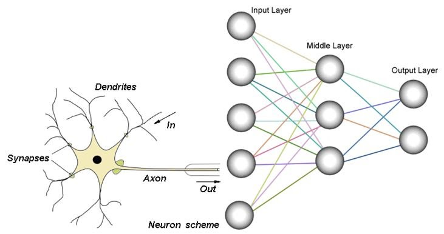

# Lab07 - Rezolvarea unor probleme de clasificare prin metode de învățare automată  

## :microscope: Obiective 

Dezvoltarea sistemelor care învaţă singure. Probleme de tip clasificare rezolvate cu ajutorul rețeleleor neuronale artificiale (Artificial Neural Networks - ANN). Evaluareaa performanței acestor metode.

## :book:  Aspecte teoretice

Rețele neuronale artificiale pentru rezolvarea problemelor de clasificare.

Proiectarea sistemelor care învaţă singure.

Evaluarea sistemelor care învaţă singure. Metrici de performanță. 
 

## :bulb: Probleme

**Retea sociala: ce fel de poze ai postat?** (TEMA) 
Tocmai ti-ai inceput prima ta zi de munca ca si software developer la Facebook in echipa care se ocupa cu partea de continut a platformei. 
Echipa de analisti a observat ca foarte multe persoane folosesc filtre peste pozele lor, asadar in speranta de a promova continut mai putin editat, si poze cat mai reale, doresc sa implementeze o noua functionalite in care sa arate utilizatorilor daca o poza a fost sau nu editata. Pentru a testa aceasta idee, si pentru a vedea daca utlizatorilor li s-ar parea folositoare o astfel de functionalitate, au decis sa testeze ideea pe pozele care au filtre sepia. 
Primul task al tau este sa implementezi un algoritm de clasificare a pozelor care sa ne spuna daca o poza are sau nu adaugat filtru sepia. 
Team leaderul echipei de ML iti propune urmatorul plan de lucru 
1. devoltarea, antrenarea si testarea unui clasificator bazat pe retele neuronale folosind date mai simple, de tip caracteristici numerice - de ex datele cu irisi) - **Lucky you! Go to DEMO!** :four_leaf_clover:
2. devoltarea, antrenarea si testarea unui clasificator bazat pe retele neuronale folosind date mai complexe, de tip imagine - de ex baza de date cu cifre, pentru fiecare exemplu se va considera matricea de pixeli) - **Lucky you! Go to DEMO!** :four_leaf_clover:
3. crearea unei baze cu imagini (cu si fara filtru sepia) si etichetele corespunzatoare - **Let’s get down to business!** :rocket:
4. antrenarea si testarea clasificatorului (bazat pe retele neuronale artificiale – tool sau ANN-ul dezvoltat) pentru clasificarea imaginilor cu si fara filtru - **It's time to hustle!** :muscle:

## :memo:  Cerinte 

Specificaţi, proiectaţi, implementaţi si testati cate un algoritm de clasificare bazat pe retele neuronale artificiale (ANN sau CNN). Verificati influenta (hyper)parametrilor asupra calitatii clasificatorului antrenat.

## :hourglass: Termen de predare 
Laborator 8

## :moneybag: Evaluarea

Punctajele acordate:
- creare baza de date - 50p
- antrenarea unui model si testarea lui pentru clasificarea imaginilor normale vs sepia 
    - cu ANN (tool) - 50p
    - influenta (hyper)parametrilor - 100p
    - cu ANN (cod propriu) - 300p
    - cu CNN (cod propriu) - 300p

Notă: 
- punctajul maxim acumulat pentru acest laborator este 800 puncte.
- punctajul minim pentru ca o tema predata sa fie valida este 100 puncte.  

