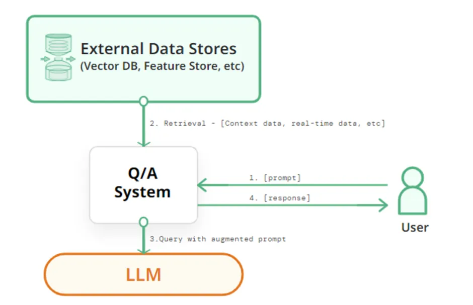

# Proiecte AI 2023-2024

## Metodologie de lucru

- Proiectele se pot realiza in echipa de maxim 4 persoane
- O echipa poate lucra la o singura tema de proiect. Un proiect poate fi ales de maxim 5 echipe, dar fiecare echipa va lucra independent.
- Echipele si temele vor fi comunicate cadrelor didactice care coordoneaza activitatea de laborator pana cel tarziu in **17aprilie 2025**.
- Proiectele se vor incarca in acest [git](https://classroom.github.com/a/Qzm42lMB). Fiecare proiect trebuie sa contina:
    - codul si explicatiile aferente (de ex. un notebook in care celulele de cod sa alterneze cu cele de explicatii) - organizate cat mai frumos 
    - un folder cu datele folosite 
    - o pagina de garda (readme) care sa contina informatii despre: echipa care a lucrat la proiect, problema abordata si un desen/schema care sa sugereze cat mai bine solutia propusa
    - cel putin cate 2 pull-request-uri (unul pentru fiecare etapa de predare) din partea fiecarui membru al echipei
- In saptamana 11 (12-16 mai) se vor prezenta, in cadrul orelor de laborator primele 2 etape (Definirea problemei si analiza datelor de intrare) si de vor incarca pe git materialele aferente
- In saptamana 13 (26 - 30 mai)  se vor prezenta, in cadrul orelor de laborator, ultimele 2 etape (Dezvoltarea modelului si Imbunatatiri) si se vor incarca pe git materialele aferente
- In saptamana 14 (2-6 iunie) se vor incarca pe git filmulete scurte de prezentare a proiectelor realizate (doar de catre echipele care au obtinut cel putin 300p pana acum).
- Evaluare:
    - definirea problemei si analiza datelor de intrare - 200p
    - dezvoltarea unui model de AI si evaluarea performantei - 300p
    - imbunatatiri - 300p
    - teaser de prezentare a solutiei dezvoltate - 200p
        - ce problema rezolva proiectul (inputs, outputs)
        - ce tip de AI s-a folosit
        - ce performanta s-a obtinut
        - care sunt [SGD](https://unstats.un.org/wiki/display/SDGeHandbook/Home)-urile impactate de un astfel de proiect (motivati alegerea unuia sau mai multor obiective)

## Teme de proiect

    
 1. Conversational Avatar Production 
    
    

### Conversational Avatar Production

#### Scop
Dezvoltarea unui sistem conversațional, care răspunde la întrebări textuale în mod vocal prin intermediul unui avatar. De ex.:
- UBB-bot care răspunde la întrebări despre UBB si are ca avatar imaginea lui Janos Bolyai
- Turing-bot care răspunde la întrebări despre AI si are ca avatar imaginea lui Alan Turing

#### Ideea de baza
În lumea digitală, interacțiunea cu avatare animate devine din ce în ce mai importantă, fie că vorbim despre asistenți virtuali, personaje din jocuri, educație interactivă sau prezentatori AI pentru conținut video generat automat. Totuși, crearea animațiilor realiste pentru vorbire și expresii faciale implică, de obicei, procese complexe și costisitoare, necesitând resurse considerabile. 
Folosind tehnici de Machine Learning, acest proces poate fi automatizat, permițând avatarelor să reproducă mișcările buzelor și expresiile faciale în timp real, pe baza unui input audio sau text. O astfel de tehnologie ar putea fi utilizată în crearea de consilieri virtuali  pentru procedura de admitere pentru cursuri online, ghidurilor interactive pentru muzee sau aplicații turistice, asistenților personalizați pentru servicii bancare și customer support, dar și în industria filmelor și jocurilor pentru generarea rapidă de personaje animate. Scopul este de a dezvolta și antrena un model AI capabil să genereze animații fluide și naturale, transformând interacțiunile virtuale într-o experiență mai autentică și captivantă. 

#### TODOlist
Pentru dezvoltarea unui asemena sistem complex nu exista o serie de pași prestabilită, dar este importanta respectarea cerinței principale. Un user adresează întrebări (prin mesaje vocale) sau discută prin intermediul prompt-urilor textuale și sistemul răspunde, prin intermediul unui avatar, atat prin mesaje scrise, cat si prin mesaje vocale. 

#### Bibliografie

În funcție de soluția elaborată, câteva cerințe parțiale ar fi utilizarea corectă a următoarelor:
- Large Language Model (LLM) – Pentru procesul de comunicare se poate folosi un LLM. Acesta poate genera răspunsuri textuale la întrebările utilizatorului 
[link](https://huggingface.co/docs/transformers/llm_tutorial)
[link](https://github.com/vllm-project/vllm)
[link](https://github.com/abetlen/llama-cpp-python)
[link](https://github.com/huggingface/text-generation-inference)
[link](https://github.com/guidance-ai/guidance)
[link](https://huggingface.co/mistralai/Mistral-7B-v0.1)  

- Text-to-Speech Model - pornind de la răspunsul textual oferit de LLM, acest “modul” din sistem, generează răspunsul vocal.
[link](https://github.com/ming024/FastSpeech2)
[link](https://github.com/CorentinJ/Real-Time-Voice-Cloning)
[link](https://github.com/DrewThomasson/VoxNovel)
[link](https://github.com/jasonppy/VoiceCraft)
[link](https://github.com/coqui-ai/TTS)
[link](https://huggingface.co/coqui/XTTS-v2)
[link](https://github.com/snakers4/silero-models) 
[link](https://github.com/daniilrobnikov/vits2)

- Alegerea unui Avatar – Acest pas nu necesita neaparat AI, se poate alege o imagine cu o persoana sau un personaj. Alternativ se poate genera un avator unic apeland la serviciile unui model bazat pe Stable Diffusion (inclusive ChatGPT sau DALL-E)
[link](https://github.com/kdjayakody/Fooocus-AI-Image-Generator)
[link](https://huggingface.co/learn/diffusion-course/unit0/1)
[link](https://openai.com/index/dall-e-2/)
[link](https://openai.com/index/dall-e-3/)

- Generarea video-ului în care avatarul răspunde – Pornind de la o imagine cu avatorul si text-ul \ audio-ul cu răspunsul se generază video-ul în care avatarul din imagine răspunde
[link](https://github.com/OpenTalker/SadTalker)
[link](https://github.com/Rudrabha/Wav2Lip)
[link](https://github.com/EvelynFan/FaceFormer)
[link](https://github.com/hzwer/ECCV2022-RIFE)

    
 2. Monitorizare probleme cosmetice ale tenului 
         
    

### Monitorizare probleme cosmetice ale tenului (riduri, puncte negre, acnee, etc.)

#### Scop

Dezvoltarea unui sistem inteligent care sa permita identificarea problemelor cosmetice ale tenului (riduri, puncte negre, acnee, etc.) si sa ofere recomandari pentru ingrijirea pielii.

#### Ideea de baza

Ridurile faciale sunt indicatori majori pentru estimarea vârstei umane și identificarea emoțiilor umane. Numeroși cercetători au propus metode de segmentare a ridurilor faciale, iar companiile de cosmetice continuă să lanseze diverse tipuri de tratamente pentru riduri. Segmentarea ridurilor faciale este un domeniu important de cercetare pentru prevenirea îmbătrânirii faciale. 

Acneea este o boală a pielii cauzată în principal de bacterii, foliculii de păr expuși la grasimi și celulele moarte ale pielii. Acestea declanșează uneori puncte albe, puncte negre sau coșuri, de obicei pe fata, gât, brațe și spatele umerilor. Acneea la adolescenți este cea mai severă, deși afectează persoane de orice vârstă. Medicii pot detecta cu ușurință acneea prin examinarea pielii pacientului, dar detectarea automată a acneei nu este ușoară pentru că aceasta poate fi confundată cu alte tipuri de leziuni ale pielii.

Pornind de la o poza a fetei pe care o clienta/un client si-o realizeaza, sa se identifice problemele cosmetice ale tenului si sa se ofere recomandari pentru ingrijirea pielii. Algoritmii de AI pot fi folosiți pentru a segmenta ridurile/acneea/punctele negre faciale din imagini, pentru a le cuantifica și pentru a oferi recomandări pentru îngrijirea pielii. 

#### TODOlist

1. Definirea problemei 
    - ce se da si ce se cere?
    - de ce e nevoie de AI pentru a rezolva problema?
2. Analiza datelor de intrare
    - ce tip de date avem?
    - cate date avem?
    - ce distributie au datele?
3. Dezvoltarea unei mini-aplicatii software care
    - sa primeasca datele de intrare (in formatul corespunzator)
    - sa ofere rezultatul (in formatul corespunzator) - hard-coded
    - sa fie pregatita pentru a integra modelul de AI
3. Dezvoltarea unui model de AI si evaluarea performantei
    - ce arhitectura are modelul de AI?
    - ce setup (parametrii si hiper-parametrii) se folosesc pentru antrenarea si validarea modelului de AI?
    - ce metrici de performanta se monitorizeaza?
4. Propuneri de imbunatatiri

#### Data
- SkinMate [link](https://github.com/C23-PR556-SkinMate/skinmate-machine-learning)
- set de date [link](https://drive.google.com/drive/folders/10LA7gA1aUot8V-JTfv9zYlpKCbLj4UXg)
- Tschandl, P., Rosendahl, C., & Kittler, H. (2018). The HAM10000 dataset, a large collection of multi-source dermatoscopic images of common pigmented skin lesions. Scientific data, 5(1), 1-9. [link](https://www.fc.up.pt/addi/ph2%20database.html) 

#### Bibliografie

- Aboulmira, A., Lachgar, M., Hrimech, H., Camara, A., Elbahja, C., Elmansouri, A., & Hassini, Y. (2024). SkinHealthMate app: An AI-powered digital platform for skin disease diagnosis. Systems and Soft Computing, 6, 200166. [link](https://www.sciencedirect.com/science/article/pii/S2772941924000954#bib0026)

- Kim, S., Yoon, H., Lee, J., & Yoo, S. (2023). Facial wrinkle segmentation using weighted deep supervision and semi-automatic labeling. Artificial Intelligence in Medicine, 145, 102679. [link](https://www.sciencedirect.com/science/article/pii/S0933365723001938)

- Liu, Z., Qi, Q., Wang, S., & Zhai, G. (2024). A novel approach to the detection of facial wrinkles: Database, detection algorithm, and evaluation metrics. Computers in Biology and Medicine, 174, 108431. [link](https://www.sciencedirect.com/science/article/pii/S0010482524005158?ref=pdf_download&fr=RR-2&rr=90f4ac833a5dc9e5#sec1)

- Kim, S., Yoon, H., & Lee, J. (2024). Semi-Supervised Facial Acne Segmentation Using Bidirectional Copy–Paste. Diagnostics, 14(10), 1040. [link](https://www.mdpi.com/2075-4418/14/10/1040#B30-diagnostics-14-01040)

- Kim, S., Lee, C., Jung, G., Yoon, H., Lee, J., & Yoo, S. (2023, June). Facial acne segmentation based on deep learning with center point loss. In 2023 IEEE 36th International Symposium on Computer-Based Medical Systems (CBMS) (pp. 678-683). IEEE. [link](https://ieeexplore.ieee.org/abstract/document/10178708)

    
 3. Identificarea cancerului de san  
        
    

### Identificarea cancerului de san

#### Scop
Dezvoltarea unui sistem inteligent care să ajute medicii în diagnosticarea timpurie a cancerului de san.

#### Ideea de baza
Detectarea cancerului de sân în mamografii este o problemă critică în imagistica medicală și diagnostic. Interpretarea mamografiilor este provocatoare din cauza variațiilor în densitatea țesuturilor, a structurilor suprapuse și a diferențelor subtile dintre tumorile benigne și maligne. 
Această problemă trebuie rezolvată folosind un algoritm inteligent, deoarece examinarea manuală tradițională de către radiologi este consumatoare de timp și predispusă la erori umane. 

Plecand de la seturile de date cu mamografii, se vor folosii modele de AI bazate pe arhitecturi de tip Transformer pentru a identifica tumori maligne si benigne in imagini. Modelele folosite pot fi pre-antrenate pe alte seturi de date si fine-tunate pe setul de date cu mamografii.

#### TODOlist

1. Definirea problemei 
    - ce se da si ce se cere?
    - de ce e nevoie de AI pentru a rezolva problema?
2. Analiza datelor de intrare
    - ce tip de date avem?
    - cate date avem?
    - ce distributie au datele?
3. Dezvoltarea unei mini-aplicatii software care
    - sa primeasca datele de intrare (in formatul corespunzator)
    - sa ofere rezultatul (in formatul corespunzator) - hard-coded
    - sa fie pregatita pentru a integra modelul de AI
3. Dezvoltarea unui model de AI si evaluarea performantei
    - ce arhitectura are modelul de AI?
    - ce setup (parametrii si hiper-parametrii) se folosesc pentru antrenarea si validarea modelului de AI?
    - ce metrici de performanta se monitorizeaza?
4. Propuneri de imbunatatiri

#### Data
- MIAS [link](http://peipa.essex.ac.uk/info/mias.html)
- DDSM [link](http://www.eng.usf.edu/cvprg/Mammography/Database.html) or [link](https://www.cancerimagingarchive.net/collection/cbis-ddsm/)
- INbreast  [link](https://www.kaggle.com/datasets/tommyngx/inbreast2012)
- DBT - [link](https://www.cancerimagingarchive.net/collection/breast-cancer-screening-dbt/)

#### Bibliografie

- Vit
    - Dosovitskiy, A. (2020). An image is worth 16x16 words: Transformers for image recognition at scale. arXiv preprint arXiv:2010.11929.
    [link](https://arxiv.org/pdf/2010.11929)
    - Code [link](https://github.com/google-research/vision_transformer) or HuggingFace models [link](https://huggingface.co/docs/transformers/en/model_doc/vit)

- CrossViT 
    - Chen, C. F. R., Fan, Q., & Panda, R. (2021). Crossvit: Cross-attention multi-scale vision transformer for image classification. In Proceedings of the IEEE/CVF international conference on computer vision (pp. 357-366). [link](https://openaccess.thecvf.com/content/ICCV2021/papers/Chen_CrossViT_Cross-Attention_Multi-Scale_Vision_Transformer_for_Image_Classification_ICCV_2021_paper.pdf)
    - Code [link](https://github.com/IBM/CrossViT)

- DeiT
    - Touvron, H., Cord, M., Douze, M., Massa, F., Sablayrolles, A., & Jégou, H. (2020). Training data-efficient image transformers & distillation through attention. arXiv 2020. arXiv preprint arXiv:2012.12877, 2(3). \href{https://arxiv.org/abs/2012.12877v2}{link}
    - Code [link](https://github.com/facebookresearch/deit/tree/2aefd8fc8634d099c1495ce9dba2b6c6a921d611)

- MammoViT
    - Al Mansour, A. G., Alshomrani, F., Alfahaid, A., & Almutairi, A. T. (2025). MammoViT: A Custom Vision Transformer Architecture for Accurate BIRADS Classification in Mammogram Analysis. Diagnostics, 15(3), 285 [link](https://www.mdpi.com/2075-4418/15/3/285)

- Gutierrez-Cardenas, J. (2024). Breast Cancer Classification Through Transfer Learning with Vision Transformer, PCA, and Machine Learning Models. International Journal of Advanced Computer Science & Applications, 15(4). [link](https://www.proquest.com/docview/3060148581?fromopenview=true&pq-origsite=gscholar&sourcetype=Scholarly%20Journals)

    
 4. Recunoasterea emotiilor in comunicatele unor persoane oficiale  

### Recunoasterea emotiilor in comunicatele unor persoane oficiale

### Scop

Dezvoltarea unui sistem inteligent care sa permita identificarea emotiilor din comunicatele unor persoane oficiale pe baza textului scris asociat comunicatului, mesajului vocal asociat comunicatului sau a mimicii celui care trasnmite comunicatul.

#### Ideea de baza
Se are in vedere dezvoltarea unui sistem cu 3 componente:
- o componenta care analizeaza emotiile in textul scris
- o componenta care analizeaza emotiile in mesajul vocal
- o componenta care analizeaza emotiiile in mimica persoanei care transmite comunicatul.

La final, se vor fuziona output-urile celor 3 componente. 

#### TODOlist

1. Definirea problemei 
    - ce se da si ce se cere?
    - de ce e nevoie de AI pentru a rezolva problema?
2. Analiza datelor de intrare
    - ce tip de date avem?
    - cate date avem?
    - ce distributie au datele?
3. Dezvoltarea unei mini-aplicatii software care
    - sa primeasca datele de intrare (in formatul corespunzator)
    - sa ofere rezultatul (in formatul corespunzator) - hard-coded
    - sa fie pregatita pentru a integra modelul de AI
3. Dezvoltarea unui model de AI si evaluarea performantei
    - ce arhitectura are modelul de AI?
    - ce setup (parametrii si hiper-parametrii) se folosesc pentru antrenarea si validarea modelului de AI?
    - ce metrici de performanta se monitorizeaza?
4. Propuneri de imbunatatiri

#### Data

- MELD dataset [link](https://affective-meld.github.io/)
- Emory [link](https://github.com/emorynlp/character-mining)
- FER [link](https://www.kaggle.com/c/challenges-in-representation-learning-facial-expression-recognition-challenge/data)
- AffWild [link](https://ibug.doc.ic.ac.uk/resources/aff-wild2/)

#### Bibliografie

- Curti, F., & Kazinnik, S. (2023). Let's face it: Quantifying the impact of nonverbal communication in FOMC press conferences. Journal of Monetary Economics, 139, 110-126. [link](https://www.sciencedirect.com/science/article/pii/S0304393223000740?casa_token=1glEZKEF3SsAAAAA:1N9OYe0N-WknNuD2jI9EZhvQ6abxYswddZYPgZ1_udhzWjIt8peIkZLDlM9sHAiR6s7yL4oIcQ)

- Some models for emotion recognition in texts [model1](https://huggingface.co/michellejieli/emotion_text_classifier) [model2](https://huggingface.co/mrm8488/t5-base-finetuned-emotion)

- Some models for emotion recognition in speech [model1](https://huggingface.co/r-f/wav2vec-english-speech-emotion-recognition)

- Some models for emotion recognition in faces [model1](https://huggingface.co/ElenaRyumina/face_emotion_recognition) [model2](https://huggingface.co/trpakov/vit-face-expression)

    
 5. Identificarea defectelor software  

### Identificarea defectelor software

#### Scop

Instrumentele AI îmbunătățesc productivitatea, dar degradează calitatea codului. 
Ultima analiză a [GitClear](https://www.gitclear.com/coding_on_copilot_data_shows_ais_downward_pressure_on_code_quality?utm_source=substack&utm_medium=email) asupra a 211 milioane de linii de cod a constatat că asistenții AI (cum ar fi Copilot) pot spori productivitatea, dar înrăutățesc calitatea codului. Aceasta arată un compromis clar: producem mai mult cod, dar bazele noastre de cod au mult mai multe duplicate și mai puține refactorizări.

#### Ideea de baza

Se va considera o baza de date cu mai multe proiecte software. Se va dezvolta un model de AI bazat pe LLM care sa identifice defectele software in codul sursa pe baza codului sursa si al metricilor de complexitate. 

Posibile versiuni de input pentru LLM (prin intermediul prompt-ului): 
- doar codul sursa al clasei curente, 
- codul sursa al clasei curente si codul sursa al claselor "parinte", 
- codul sursa al clasei curente si codul sursa al claselor "parinte", precum si metrici de complexitate asociate codului sursa (metrici precum complexitatea ciclomatica [link](https://d1wqtxts1xzle7.cloudfront.net/48213691/tse.1976.23383720160821-12832-sniirk-libre.pdf?1471767990=&response-content-disposition=inline%3B+filename%3DA_Complexity_Measure.pdf&Expires=1743369021&Signature=FrLxyskf0pTFRiM~Q30qykafb4a-m071sO87klcxqXqJBcRJGOYOZ5CY94KFjsADNciMoVd4CNwPVHiVkgcACxxV-V~Bod8D8eI1gP7q8sHR0a5qhrIhpfePgf54kCvxGbTP-dFu9YItw~E2FXb~PQRIfzL9BmczizOXSASL1To9qFYCVhJv9MT-CoTABaSPQ8T4-9ZFVzdPwgXFX3e3oRYjotU3EWC6HkdWUG0gRvmMqONAyLWrxY8xFU4m7PkVnmAasyN7G9L38-DBsF8AUJT6CpjFfvAaAigK0iv8TkFYzyfbR5pu97LLH5w622qHtRc9tuo~3Qu2J9SPO0JGSA__&Key-Pair-Id=APKAJLOHF5GGSLRBV4ZA), 
complexitatea cognitiva [link](https://www.researchgate.net/publication/313803215_Automated_tool_for_the_calculation_of_cognitive_complexity_of_a_software), Weighted methods per Class [link](https://www.researchgate.net/publication/313803215_Automated_tool_for_the_calculation_of_cognitive_complexity_of_a_software), Lack of Cohesion in Methods [link](https://www.researchgate.net/publication/313803215_Automated_tool_for_the_calculation_of_cognitive_complexity_of_a_software), Depth of inheritance tree [link](https://www.researchgate.net/publication/313803215_Automated_tool_for_the_calculation_of_cognitive_complexity_of_a_software), Halstead’s Metrics [link](https://books.google.ro/books/about/Elements_of_Software_Science.html?id=zPcmAAAAMAAJ&redir_esc=y), 
Size metrics - Lines of Code [link](https://www.researchgate.net/publication/328646564_On_the_correlation_between_testing_effort_and_software_complexity_metrics)) 

Output asteptat: defectele software identificate in codul sursa (daca clasa contine sau nu contine bug-uri, ce fel de bug contine)

#### TODOlist

1. Definirea problemei 
    - ce se da si ce se cere?
    - de ce e nevoie de AI pentru a rezolva problema?
2. Analiza datelor de intrare
    - ce tip de date avem?
    - cate date avem?
    - ce distributie au datele?
3. Dezvoltarea unei mini-aplicatii software care
    - sa primeasca datele de intrare (in formatul corespunzator)
    - sa ofere rezultatul (in formatul corespunzator) - hard-coded
    - sa fie pregatita pentru a integra modelul de AI
3. Dezvoltarea unui model de AI si evaluarea performantei
    - ce arhitectura are modelul de AI?
    - ce setup (parametrii si hiper-parametrii) se folosesc pentru antrenarea si validarea modelului de AI?
    - ce metrici de performanta se monitorizeaza?
4. Propuneri de imbunatatiri

#### Data
- Data [link](https://www.inf.szte.hu/~ferenc/pdf/FTL18-PROMISE-A%20public%20unified%20bug%20dataset%20for%20Java.pdf)

#### Bibliografie

- List of research papers focused on Large Language Models [link](https://github.com/PurCL/CodeLLMPaper/tree/main)

- Simões, I. R. D. S., & Venson, E. (2024, November). Evaluating Source Code Quality with Large Language Models: a comparative study. In Proceedings of the XXIII Brazilian Symposium on Software Quality (pp. 103-113).
[link](https://www.researchgate.net/publication/383119379_Evaluating_Source_Code_Quality_with_Large_Languagem_Models_a_comparative_study)

- Wadhwa, N., Pradhan, J., Sonwane, A., Sahu, S. P., Natarajan, N., Kanade, A., ... & Rajamani, S. (2024). Core: Resolving code quality issues using llms. Proceedings of the ACM on Software Engineering, 1(FSE), 789-811 [link](https://dl.acm.org/doi/pdf/10.1145/3643762)

- Jelodar, H., Meymani, M., & Razavi-Far, R. (2025). Large Language Models (LLMs) for Source Code Analysis: applications, models and datasets. arXiv preprint arXiv:2503.17502 [link](https://www.researchgate.net/publication/390143194_Large_Language_Models_LLMs_for_Source_Code_Analysis_applications_models_and_datasets)

- Fang, C., Miao, N., Srivastav, S., Liu, J., Zhang, R., Fang, R., ... & Homayoun, H. (2024). Large language models for code analysis: Do {LLMs} really do their job?. In 33rd USENIX Security Symposium (USENIX Security 24) (pp. 829-846) [link](https://www.usenix.org/system/files/sec24fall-prepub-2205-fang.pdf)

- Backström, O., & Kihlert, A. (2023). Code Quality and Large Language Models in Computer Science Education: Enhancing student-written code through ChatGPT [link](https://www.diva-portal.org/smash/get/diva2:1779791/FULLTEXT01.pdf)

    
 6. Estimarea risk-ului de peri-implantita  
     

### Estimarea risk-ului de peri-implantita

#### Scop
Modele AI pentru evaluarea riscului de aparitie  a periimplantitei  [link](2024-2025\Projects\Implant planning-articole.pptx)

#### Ideea de baza
Dandu-se o colectie de documente text (articles, case reports, reviews, etc.), se inspecteaza colectia si se cauta factorii care au determinat esecul tratamentului implantar. In functie de anumite criterii (frecventa = in cate articole apare acel factor, intensitate = daca s-a cuantificat cumva influenta acelui factor) se da un scor de risc fiecarui factor. Se creaza 1 chestionar cu acest sistem de scoring care se va valida clinic.
- algoritmi AI de identificare a factorilor asociati cu dezvolatrea periimplantitei  
- acordarea unui scor de risc in functie de datele gasite in literatura 
- dezvoltaea unui algoritm de calcul a riscului 
- validarea algoritmului dezvolatat  pe cazuri clinice 

#### TODOlist

1. Definirea problemei 
    - ce se da si ce se cere?
    - de ce e nevoie de AI pentru a rezolva problema?
2. Analiza datelor de intrare
    - ce tip de date avem?
    - cate date avem?
    - ce distributie au datele?
3. Dezvoltarea unei mini-aplicatii software care
    - sa primeasca datele de intrare (in formatul corespunzator)
    - sa ofere rezultatul (in formatul corespunzator) - hard-coded
    - sa fie pregatita pentru a integra modelul de AI
3. Dezvoltarea unui model de AI si evaluarea performantei
    - ce arhitectura are modelul de AI?
    - ce setup (parametrii si hiper-parametrii) se folosesc pentru antrenarea si validarea modelului de AI?
    - ce metrici de performanta se monitorizeaza?
4. Propuneri de imbunatatiri

#### Data
- Date din literatura - 3 baze de date PubMed, Embase , Google scholar - model de cautare si identificare a esecului implantar 
- cateva exemple cu documente [link](2024-2025\Projects\Articole implat failure.zip)

    
 7. Alinierea de concepte 
    
    

### Alinierea de concepte

#### Scop
Alinierea conceptelor constă în a găsi descrieri diferite ale acestora care se referă la aceeași entitate din lumea reală în diferite surse de date (de exemplu, fișiere de date, cărți, site-uri web și baze de date). Aceasta este o problemă esențială în gestionarea datelor, deoarece permite consolidarea informațiilor dispersate și eliminarea redundanțelor. Prin utilizarea tehnicilor avansate de învățare automată și algoritmi de potrivire, alinierea conceptelor poate îmbunătăți semnificativ calitatea și acuratețea datelor, facilitând astfel analize mai precise și decizii mai informate. În plus, această tehnologie este crucială pentru integrarea datelor în proiecte mari, cum ar fi cele din domeniul sănătății, finanțelor și comerțului electronic, unde datele provin din numeroase surse și trebuie corelate corect pentru a oferi o imagine completă și coerentă.

#### Ideea de baza
Se consideră 2 baze de date care conțin informații despre produse (de exemplu, preț, descriere, imagine) de la 2 furnizori diferiți. Scopul este de a identifica produsele care sunt aceleași în cele 2 baze de date, dar sunt descrise diferit. Se va dezvolta un model de AI care să identifice produsele care sunt aceleași, dar sunt descrise diferit în cele 2 baze de date. Se pot investiga mai multe reprezentări ale descrierilor produselor:
- concatenarea atributelor produsului (de exemplu, nume, preț, descriere) si asocierea unui embedding (folosind un model de AI pre-antrenat pe text), urmat de un pas de clasificare binara (produse aliniate sau diferite)
- asocierea unui embedding pentru fiecare atribut si concatenarea acestora, urmat de un pas de clasificare binara (produse aliniate sau diferite)
- interogarea unui LLM daca cele 2 descrieri sunt despre acelasi produs

#### TODOlist
1. Definirea problemei 
    - ce se da si ce se cere?
    - de ce e nevoie de AI pentru a rezolva problema?
2. Analiza datelor de intrare
    - ce tip de date avem?
    - cate date avem?
    - ce distributie au datele?
3. Dezvoltarea unei mini-aplicatii software care
    - sa primeasca datele de intrare (in formatul corespunzator)
    - sa ofere rezultatul (in formatul corespunzator) - hard-coded
    - sa fie pregatita pentru a integra modelul de AI
3. Dezvoltarea unui model de AI si evaluarea performantei
    - ce arhitectura are modelul de AI?
    - ce setup (parametrii si hiper-parametrii) se folosesc pentru antrenarea si validarea modelului de AI?
    - ce metrici de performanta se monitorizeaza?
4. Propuneri de imbunatatiri

#### Data

- [Abt-Buy](https://paperswithcode.com/dataset/abt-buy)
- [Amazon-Google](https://paperswithcode.com/dataset/amazon-google)

#### Bibliografy

- Christophides, V., Efthymiou, V., Palpanas, T., Papadakis, G., & Stefanidis, K. (2019). End-to-end entity resolution for big data: A survey. arXiv preprint arXiv:1905.06397. [link](https://arxiv.org/pdf/1905.06397)
Barlaug, N., & Gulla, J. A. (2021). Neural networks for entity matching: A survey. ACM Transactions on Knowledge Discovery from Data (TKDD), 15(3), 1-37. [link](https://arxiv.org/pdf/2010.11075)

- Li, Y., Li, J., Suhara, Y., Doan, A., & Tan, W. C. (2020). Deep entity matching with pre-trained language models. arXiv preprint arXiv:2004.00584. [link](https://arxiv.org/pdf/2004.00584) [code](https://github.com/megagonlabs/ditto)

- Peeters, R., Steiner, A., & Bizer, C. (2023). Entity matching using large language models. arXiv preprint arXiv:2310.11244. [link](https://arxiv.org/pdf/2310.11244v4) [code](https://github.com/wbsg-uni-mannheim/matchgpt)

    
 8. Helpdesk bazat pe LLM 
 

### Sistem automat pentru helpdesk bazat pe LLM

#### Scop
Dezvoltarea unui sistem inteligent care să poată să răspundă la întrebări folosind un LLM și o colecție de documente.

#### Ideea de baza

Dezvoltarea unui sistem de tip Retrieval-Augmented Generation (RAG) care să poată să răspundă la întrebări folosind un LLM și o colecție de documente. Sistemul va folosi un model de tip RAG pentru a căuta în colecția de documente și a genera răspunsuri la întrebările utilizatorilor. De obicei, un sistem RAG cauta in colectia de doucmente, pe baza unei interogari, docuemntele (sau partile de document) cele mai relevante si le concateneaza cu interogarea pentru a genera un raspuns.
Etapele principale sunt:
- indexarea documentelor din colectie (o modalitate de reprezentare cat mai relevanta pt LLM-ul care va cauta in ele)
- cautarea celor mai relevante documente pentru o anumita interogare (querry)
- generarea textului/raspunsului pe baza interogarii si a documentelor gasite, folosind un algoritm inteligent de generare 
- evaluarea raspunsului generat 

Iteratii in explorare:
- Iteratia 1 - folosirea unui set de date public
- Iteratia 2 - folosirea unui set de date privat 

#### TODOlist

1. Definirea problemei 
    - ce se da si ce se cere?
    - de ce e nevoie de AI pentru a rezolva problema?
2. Analiza datelor de intrare
    - ce tip de date avem?
    - cate date avem?
    - ce distributie au datele?
3. Dezvoltarea unei mini-aplicatii software care
    - sa primeasca datele de intrare (in formatul corespunzator)
    - sa ofere rezultatul (in formatul corespunzator) - hard-coded
    - sa fie pregatita pentru a integra modelul de AI
3. Dezvoltarea unui model de AI si evaluarea performantei
    - ce arhitectura are modelul de AI?
    - ce setup (parametrii si hiper-parametrii) se folosesc pentru antrenarea si validarea modelului de AI?
    - ce metrici de performanta se monitorizeaza?
4. Propuneri de imbunatatiri

#### Data

- Public data [link](https://github.com/MoritzLaurer/rag-demo/tree/master)
- Private data - coming soon

#### Bibliografie

- RAG demo [link](https://github.com/MoritzLaurer/rag-demo/tree/master)
- Example of building a RAG with LangChain [link](https://python.langchain.com/docs/tutorials/rag/)
- Lewis, P., Perez, E., Piktus, A., Petroni, F., Karpukhin, V., Goyal, N., ... & Kiela, D. (2020). Retrieval-augmented generation for knowledge-intensive nlp tasks. Advances in neural information processing systems, 33, 9459-9474 [link](https://arxiv.org/pdf/2005.11401)
- Better Customer Support Using Retrieval-Augmented Generation (RAG) at Thomson Reuters [link](https://medium.com/tr-labs-ml-engineering-blog/better-customer-support-using-retrieval-augmented-generation-rag-at-thomson-reuters-4d140a6044c3)
- Survey of different RAG systems [link](https://www.youtube.com/watch?v=mE7IDf2SmJg)
- RAG from scratch [link](https://www.freecodecamp.org/news/mastering-rag-from-scratch/)

    
 9. Identificarea cancerului de plaman  
    
    

### Identificarea cancerului de plaman

#### Scop
Dezvoltarea unui sistem inteligent care să ajute medicii în diagnosticarea timpurie a cancerului de plămân.

#### Ideea de baza

Deși cancerul pulmonar este recunoscut ca fiind cel mai mortal tip de cancer, un prognostic bun și un tratament eficient depind de detectarea timpurie a acestuia. Povara medicilor poate fi redusa cu ajutorul tehnicilor de AI care sunt esențiale în automatizarea diagnosticului și clasificării bolilor.

De aceea, se dorește dezvoltarea unui sistem inteligent care să ajute medicii în diagnosticarea timpurie a cancerului de plămân. Un astfel de sistem ar putea folosi algoritmi avansați de învățare profundă și rețele neuronale convoluționale pentru a analiza imagini medicale și a identifica semnele precoce ale cancerului pulmonar cu o precizie ridicată1. Acest lucru ar permite medicilor să detecteze cancerul în stadii incipiente, când opțiunile de tratament sunt mai eficiente și șansele de supraviețuire sunt mai mari2.

Implementarea unui astfel de sistem ar putea reduce semnificativ timpul necesar pentru diagnosticare și ar diminua riscul de erori umane1. În plus, ar putea oferi suport în luarea deciziilor clinice, ajutând medicii să aleagă cele mai potrivite tratamente pentru fiecare pacient în parte, pe baza caracteristicilor specifice ale tumorii și ale pacientului. Astfel, dezvoltarea unui sistem inteligent pentru diagnosticarea timpurie a cancerului de plămân nu doar că ar ușura munca medicilor, dar ar putea salva numeroase vieți prin îmbunătățirea ratei de detectare precoce și a eficienței tratamentelor.

#### TODOlist

1. Definirea problemei 
    - ce se da si ce se cere?
    - de ce e nevoie de AI pentru a rezolva problema?
2. Analiza datelor de intrare
    - ce tip de date avem?
    - cate date avem?
    - ce distributie au datele?
3. Dezvoltarea unei mini-aplicatii software care
    - sa primeasca datele de intrare (in formatul corespunzator)
    - sa ofere rezultatul (in formatul corespunzator) - hard-coded
    - sa fie pregatita pentru a integra modelul de AI
3. Dezvoltarea unui model de AI si evaluarea performantei
    - ce arhitectura are modelul de AI?
    - ce setup (parametrii si hiper-parametrii) se folosesc pentru antrenarea si validarea modelului de AI?
    - ce metrici de performanta se monitorizeaza?
4. Propuneri de imbunatatiri

#### Data

- Chest CT-scane images [link](https://www.kaggle.com/datasets/mohamedhanyyy/chest-ctscan-images/data)
- Lung Image Database Consortium image collection (LIDC-IDRI) [link](https://www.cancerimagingarchive.net/collection/lidc-idri/)

#### Bibliografie

- Liu, J. A., Yang, I. Y., & Tsai, E. B. (2022). Artificial intelligence (AI) for lung nodules, from the AJR special series on AI applications. American Journal of Roentgenology, 219(5), 703-712. [link](https://ajronline.org/doi/10.2214/AJR.22.27487) 

- Gu, Y., Chi, J., Liu, J., Yang, L., Zhang, B., Yu, D., ... & Lu, X. (2021). A survey of computer-aided diagnosis of lung nodules from CT scans using deep learning. Computers in biology and medicine, 137, 104806. [link](https://www.sciencedirect.com/science/article/pii/S0010482521006004?casa_token=qhi8cSHcd5UAAAAA:iUwm4l441GNq0Ph2QQ8gW5tConmiyHUtm6ynRLEi1b7Io2HdL6qI0hSggNQPfHWn16XeO4FDNQ#sec4)

- Javed, R., Abbas, T., Khan, A. H., Daud, A., Bukhari, A., & Alharbey, R. (2024). Deep learning for lungs cancer detection: a review. Artificial Intelligence Review, 57(8), 197. [link](https://link.springer.com/article/10.1007/s10462-024-10807-1)

- Shatnawi, M. Q., Abuein, Q., & Al-Quraan, R. (2025). Deep learning-based approach to diagnose lung cancer using CT-scan images. Intelligence-Based Medicine, 11, 100188. [link](https://www.sciencedirect.com/science/article/pii/S2666521224000553#bib41)

- Hiraman, A., Viriri, S., & Gwetu, M. (2024). Lung tumor segmentation: a review of the state of the art. Frontiers in Computer Science, 6, 1423693. [link](https://www.frontiersin.org/journals/computer-science/articles/10.3389/fcomp.2024.1423693/full)

- Jayaram, J., Haw, S. C., Palanichamy, N., Anaam, E., & Kumar, S. (2025). A Systematic Review on Effectiveness and Contributions of Machine Learning and Deep Learning Methods in Lung Cancer Diagnosis and Classifications. International Journal of Computing, 17(1), 1-12. [link](https://iiict.uob.edu.bh/IJCDS/papers/1571032811.pdf)

    
 10. Voice to text  
    
    

### Identificarea cancerului de plaman

#### Scop
Dezvoltarea unui sistem inteligent care să ajute medicii pentru a completa in mod automat fisa pacientului.

#### Ideea de baza

Munca medicilor este plina de provocari. Mai ales cand trebuie sa faca multe task-uri, uneori simultan, precum realizarea si citirea unei ecografii si inregistrarea observatiilor facute. De aceea este nevoie de un sistem inteligent care sa transforme informatia audio inregistrata de catre un medic in format text si sa completeze in mod automat rubricile dedicate din fisa pacientului.
Se va pleca de la inregistrari audio precum [aceasta](Projects/voice2text/test1.ogg), se vor converti in format text si se va compelta automat partea evidentiata cu galben din fisa pacientului, precum [aceasta](Projects/voice2text/patient1.odt) (informatiile respective se vor salva intr-un tabel/jason si apoi se vor exporta intr-un document word)

Iteratia1 - informatiile sunt furnizate in limba engleza (Echivalentul celor din exemple)

Iteratia2 - informatiile sunt furnizate in limba romana

#### TODOlist

1. Definirea problemei 
    - ce se da si ce se cere?
    - de ce e nevoie de AI pentru a rezolva problema?
2. Analiza datelor de intrare
    - ce tip de date avem?
    - cate date avem?
    - ce distributie au datele?
3. Dezvoltarea unei mini-aplicatii software care
    - sa primeasca datele de intrare (in formatul corespunzator)
    - sa ofere rezultatul (in formatul corespunzator) - hard-coded
    - sa fie pregatita pentru a integra modelul de AI
3. Dezvoltarea unui model de AI si evaluarea performantei
    - ce arhitectura are modelul de AI?
    - ce setup (parametrii si hiper-parametrii) se folosesc pentru antrenarea si validarea modelului de AI?
    - ce metrici de performanta se monitorizeaza?
4. Propuneri de imbunatatiri

#### Data

- inregistrari audio [link](Projects/voice2text/test1.ogg) [link](Projects/voice2text/test2.ogg) [link](Projects/voice2text/test3.ogg)
- fisa pacientului [link](Projects/voice2text/patient1.odt)
 
#### Bibliografie

- [Whisper](https://openai.com/index/whisper/)
- [DeepSpeech](https://github.com/mozilla/DeepSpeech)
- [RobinASR](https://github.com/racai-ai/RobinASR) - for romanian
- [speech2text](https://huggingface.co/docs/transformers/model_doc/speech_to_text)
- [wav2vec](https://ai.meta.com/research/impact/wav2vec/)
- [wav2vec2](https://huggingface.co/docs/transformers/model_doc/wav2vec2)
- [romanian wav2vec2](https://huggingface.co/gigant/romanian-wav2vec2)
- [wavLM](https://huggingface.co/docs/transformers/model_doc/wavlm)

