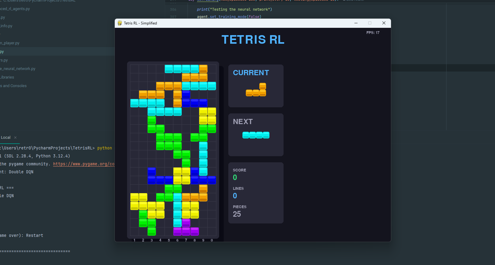
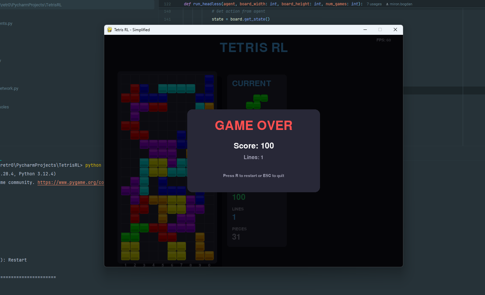

# Tetris Reinforcement Learning Framework

A research-oriented framework for developing and training RL agents on Tetris. Used for educational purposes.
Created for the UBB AI Autumn Bootcamp 2025.

**Students:** Alexandru-Bogdan Miron, Letu Andrei

**Supervisor:** Prof. Laura Silvia Diosan, Babes Bolyai University of Cluj-Napoca

## Purpose

This framework provides a complete environment for researching and implementing reinforcement learning agents that play Tetris. The game mechanics are simplified to focus on strategic decision-making: agents select where and how to place pieces, which drop instantly. This abstraction removes timing complexity and allows researchers to concentrate on developing effective learning algorithms and policies.



## Quick Start

```bash
# Install dependencies
pip install torch numpy pygame

# Compile torch with CUDA support
pip install torch torchvision --index-url https://download.pytorch.org/whl/cu121

# Play manually to understand the game
python main.py --agent human

# Train a neural network agent
python main.py --agent simplenn --no-gui --games 1000

# Watch a trained agent play
python main.py --agent simplenn
```

## Framework Features

### Research Tools
- **Modular agent architecture**: Implement custom agents by extending base classes
- **State representation**: Structured game state with board configuration, piece information, and valid actions
- **Reward customization**: Design reward functions to shape agent behavior
- **Training infrastructure**: Built-in training loops with episode management and statistics tracking
- **Performance metrics**: Track scores, lines cleared, and learning progress

### Visualization
- **Real-time GUI**: Watch agents learn and play with PyGame-based visualization
- **Statistics display**: Live tracking of score, lines, pieces, and game state
- **Headless mode**: Faster training without rendering overhead

## Game Mechanics

### State Space
Each state contains:
- Board configuration (20×10 grid, values 0-7 representing empty or piece types)
- Current piece type and next piece preview
- Game statistics (score, lines cleared, pieces placed)
- List of valid (column, rotation) actions

### Action Space
Actions are `(column, rotation)` tuples:
- Column: 0-9 (left edge of piece placement)
- Rotation: 0-3 (varies by piece type)

Pieces drop instantly to the lowest valid position in the selected column.



### Reward Structure
Agents learn through custom reward functions. Common components:
- **Line clears**: Exponential rewards (1 line = 100, 4 lines = 800)
- **Survival**: Small positive reward per successful placement
- **Height penalties**: Negative reward for increasing maximum column height
- **Hole penalties**: Negative reward for creating empty cells below filled cells
- **Game over**: Large negative terminal reward

Researchers can modify reward functions to explore different learning objectives.


## Implemented Agents

The framework includes several baseline and advanced agents for comparison and research:

### Baseline Agents
- **Random Agent**: Selects actions uniformly at random (baseline performance)
- **Greedy Agent**: Uses hand-crafted heuristics (height, holes, bumpiness)
- **Heuristic RL Agent**: Learns optimal weights for heuristic features

### Deep Learning Agents

**Simple Neural Network (CNN)**
- Convolutional architecture for spatial pattern recognition
- Processes board state through multiple conv layers
- Custom reward shaping for height and hole management

**Deep Q-Network (DQN)**
- Experience replay buffer for decorrelated training samples
- Separate target network for stable Q-value targets
- Epsilon-greedy exploration strategy

**Double DQN**
- Addresses Q-value overestimation bias
- Uses policy network for action selection, target network for evaluation
- More stable learning than standard DQN

**Dueling DQN**
- Separates state value V(s) from action advantage A(s,a)
- More efficient learning when action choice has limited impact
- Improved generalization across similar states

**REINFORCE (Policy Gradient)**
- Directly learns stochastic policy π(a|s)
- Monte Carlo returns for policy updates
- No value function required

**Advantage Actor-Critic (A2C)**
- Actor learns policy, critic learns value function
- Lower variance than pure policy gradient methods
- Entropy regularization for exploration

**Prioritized Experience Replay**
- Samples experiences based on TD error magnitude
- Learns more efficiently from important transitions
- Importance sampling for bias correction


## Research Directions

This framework enables exploration of:
- **Reward engineering**: How different reward structures affect learned strategies
- **Architecture design**: Comparing CNNs, MLPs, and other network structures. Modifying those structures and learning how different implementations affect the outcome
- **Algorithm comparison**: Relative performance of value-based vs policy-based methods
- **Hyperparameter tuning**: Learning rates, exploration strategies, network sizes
- **Curriculum learning**: Progressive difficulty
- **Multi-objective optimization**: Balancing score, survival time, and style

## Technical Requirements

- Python 3.8+
- PyTorch (CPU or CUDA)
- NumPy
- PyGame (for GUI)

Check GPU availability:
```bash
python cuda_info.py
```

## Contributing

This is an educational framework designed for experimentation. Researchers are encouraged to:
- Implement novel RL algorithms
- Design better state representations
- Experiment with reward structures
- Optimize hyperparameters
- Extend game mechanics
